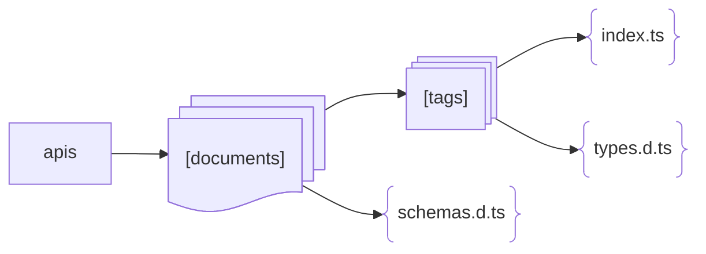
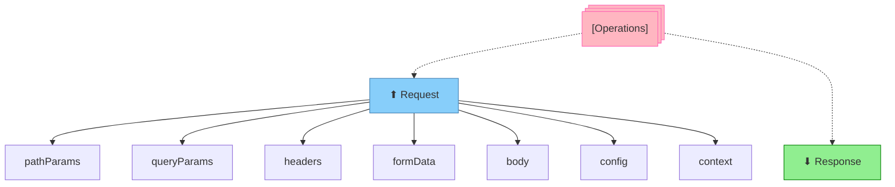
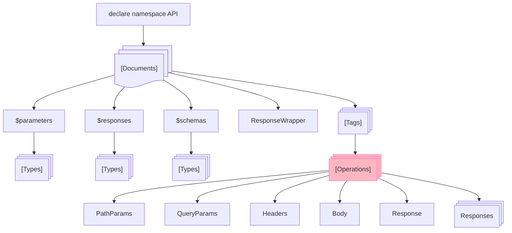
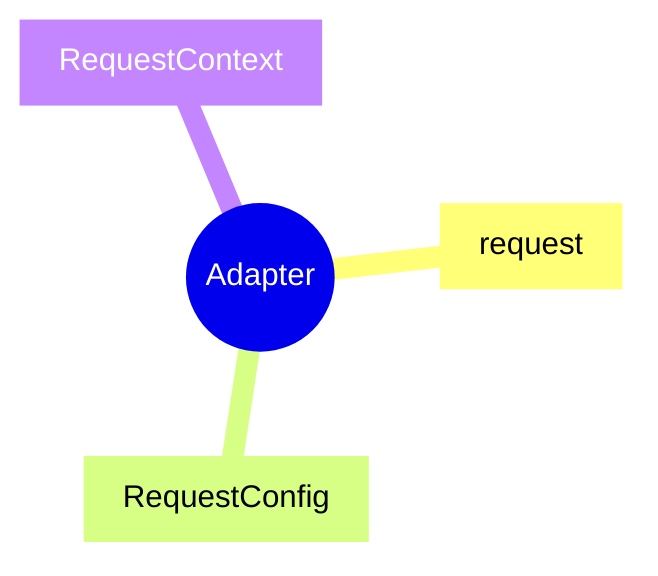

# AutoAPI

AutoAPI 是一个基于 [OpenAPI](https://www.openapis.org/) / [Swagger](https://swagger.io/) 文档自动生成原子化请求方法和
TypeScript 类型的工具。

简体中文 | [English](./README.md)

## 特性

+ **原子化请求方法**：独立且随处调用，并利于摇树优化
+ **自动生成类型**：无需手动维护，自动生成参数类型和响应类型，彻底摆脱参照文档书写类型的烦恼，并减少遗漏和出错的可能性
+ **类型推断**：就是可以将 JSON 数据转换为 TypeScript 类型。假如没有文档，或者文档中缺少结构定义，那么你就可以通过配置手动请求将响应的数据转换为响应类型
+ **精细化控制**：灵活配置过滤、分组、命名规则、类型结构等生成细节
+ **适配器机制**：使用自定义适配器以适应不同的业务场景
+ **支持 SSR**：可在服务端渲染时可传递上下文参数，需手动在适配器中添加参数透传的逻辑
+ **优秀的 [API 结构](#api-结构) 管理**：支持多文档、多分组

## 要求

+ 需具备 [OpenAPI](https://www.openapis.org/) / [Swagger](https://swagger.io/) 文档，或者手动声明 API
+ 需在项目中使用 [TypeScript](https://www.typescriptlang.org/)
+ 需自行实现 [适配器](#适配器) 逻辑。放心，这很容易

## 安装

<details open>
<summary>npm</summary>

```shell
npm install -D @autoapi/cli
```

</details>

<details>
<summary>pnpm</summary>

```shell
pnpm add -D @autoapi/cli
```

</details>

<details>
<summary>yarn</summary>

```shell
yarn add -D @autoapi/cli
```

</details>

## 使用

### 初始化

```shell
npx autoapi --init
```

执行初始化后，会生成一个 `.autoapi` 目录，其中包含配置文件 `config.ts`

### 配置示例

```ts
// .autoapi/config.ts

import { defineConfig } from '@autoapi/cli'

export default defineConfig({
  docs: [
    {
      namespace: 'Example',
      adapter: '/path/to/your/adapter.ts',
      source: 'https://api.example.com/autoapi.json' // or YAML
    },

    // More ...
  ]
})
```

### 构建命令

#### 构建全部文档

```shell
npx autoapi
```

#### 构建指定文档

```shell
npx autoapi -ns Foo Bar Baz
```

## 配置

AutoAPI 配置文件放在 `.autoapi` 目录下，可以命名为以下任意名称：

+ `config.ts`（首选，我们在内部使用 [tsx](https://tsx.is/) 执行）
+ `config.js`
+ `config.cjs`
+ `config.mjs`
+ `config.json`

[查看配置文档 →](./docs/configuration-zh.md)

[查看配置示例 →](examples/.autoapi)

## 适配器

实现一个基于 [Axios](https://axios-http.com/) 的基础适配器：

```ts 
import { RequestOptions } from '@autoapi/cli'
import axios from 'axios'

const instance = axios.create({
  baseURL: 'https://api.example.com'
})

/**
 * 获取 body 数据
 * @param options
 */
function getBodyData (options: RequestOptions) {
  const { formData, body } = options

  /**
   * 如果存在 `formData` 参数，说明要发送表单数据，需要将其转换为 `new FormData()` 实例
   * `formData` 选项是专门为简化传递表单数据设计的
   * 它和传递 `body` 并将 `Content-Type` 设置为 `multipart/form-data` 是一致的
   */
  if (formData) {
    const form = new FormData()
    for (const key in formData) {
      form.append(key, formData[key])
    }
    return form
  }

  /**
   * 你可以在这里根据 `Content-Type` 来做各种 body 数据的转换，
   * 如 `text/xml`, `application/x-www-form-urlencoded` 等
   */
  // switch (options.headers['Content-Type']) {
  //   // case 'multipart/form-data':
  //   // case 'text/xml':
  // }

  return body
}

/**
 * 请求适配器
 * 必须导出一个名为 `request` 的函数
 * @param method 请求方法
 * @param path 请求路径
 * @param options 请求选项
 */
export function request<T> (method: string, path: string, options: RequestOptions) {
  if (options.context) {
    // 如果项目中使用 SSR，并且存在上下文参数时，可在这里处理参数透传的逻辑
  }

  return instance.request<T>({
    ...options.config,
    method,
    url: path,
    params: options.queryParams,
    data: getBodyData(options),
  })
}
```

## API 结构

### 文件目录



### 操作方法



### 类型声明



### 适配器



## 致谢

+ [OpenAPI](https://www.openapis.org/) & [Swagger](https://swagger.io/) - OpenAPI 规范（前身为 Swagger 规范）是定义
  RESTful 接口的世界标准。 OAS 使开发人员能够设计出与技术无关的 API 接口，为其 API 的开发和使用奠定基础。
+ [change-case](https://github.com/blakeembrey/change-case/) - 在 camelCase、PascalCase、Capital
  Case、snake_case、param-case、CONSTANT_CASE 等大小写之间转换字符串。
+ [js-yaml](https://github.com/nodeca/js-yaml/) - JavaScript YAML 解析器和转储器。 速度极快
+ [Prettier](https://prettier.io/) - Prettier 是一个固执己见的代码格式化程序
+ [APIs.guru](https://apis.guru/) - Wikipedia for WEB APIs
