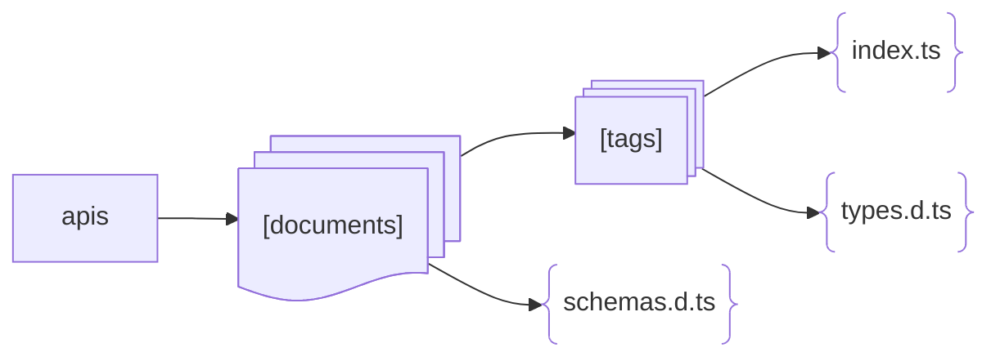
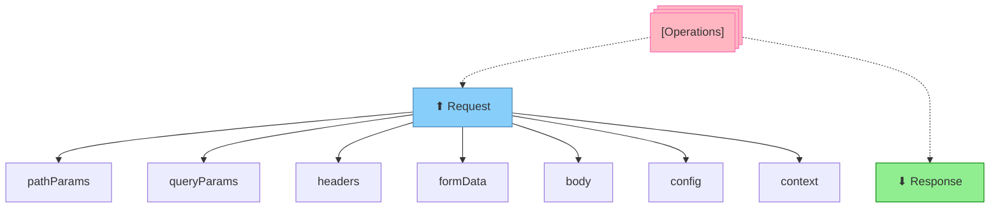
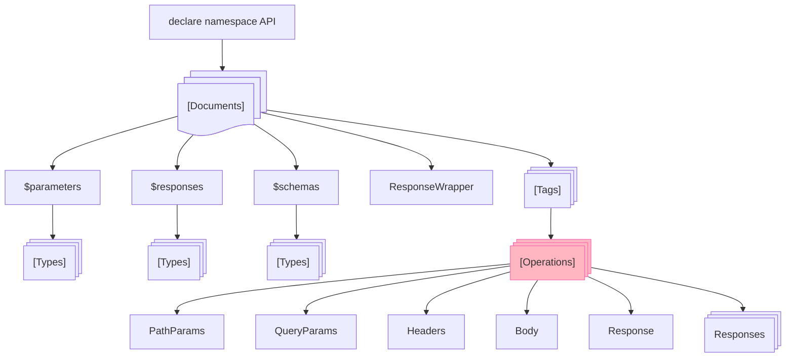
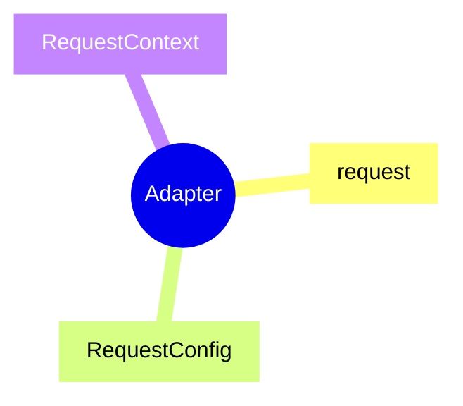

# AutoAPI

AutoAPI is a tool based on [OpenAPI](https://www.openapis.org/) / [Swagger](https://swagger.io/) documents to
automatically generate atomic request methods and TypeScript types.

English | [简体中文](./README-zh.md)

## Features

+ **Atomic Request Methods**: Self-contained, reusable anywhere, and tree-shakeable.
+ **Automatic Type Generation**: Eliminates the need to manually maintain parameter and response types, reducing the
  chance of errors or omissions.
+ **Type Inference**: Converts JSON data into TypeScript types. If documentation is incomplete or unavailable, you can
  configure manual requests to derive response types.
+ **Fine-grained Control**: Flexible configuration for filtering, grouping, naming conventions, and type structure
  customization.
+ **Adapter Mechanism**: Custom adapters can be implemented to fit various business scenarios.
+ **SSR Support**: Allows passing context parameters during server-side rendering, with logic for parameter forwarding
  implemented in adapters.
+ **Efficient [API Structure](#api-structures) Management**: Supports multiple documents and groupings.

## Requirements

+ Requires [OpenAPI](https://www.openapis.org/) / [Swagger](https://swagger.io/) documents or manually declared APIs.
+ Project must use [TypeScript](https://www.typescriptlang.org/).
+ Requires custom implementation of [adapter](#adapters) logic—don’t worry, it’s simple.

## Installation

<details open>
<summary>npm</summary>

```shell
npm install -D @autoapi/cli
```

</details>

<details>
<summary>pnpm</summary>

```shell
pnpm add -D @autoapi/cli
```

</details>

<details>
<summary>yarn</summary>

```shell
yarn add -D @autoapi/cli
```

</details>

## Usage

### Initialization

```shell
npx autoapi --init
```

After initialization, a `.autoapi` directory will be created, containing a `config.ts` configuration file.

### Configuration Example

```ts
// .autoapi/config.ts

import { defineConfig } from '@autoapi/cli'

export default defineConfig({
  docs: [
    {
      namespace: 'Example',
      adapter: '/path/to/your/adapter.ts',
      source: 'https://api.example.com/autoapi.json' // or YAML
    },

    // More ...
  ]
})
```

### Build Commands

#### Build All Documents

```shell
npx autoapi
```

#### Build Specific Documents

```shell
npx autoapi --namespaces Foo Bar Baz
```

## Configuration

AutoAPI configuration files are located in the `.autoapi` directory and can be named as follows:

+ `config.ts` (preferred, executed internally with [tsx](https://tsx.is/))
+ `config.js`
+ `config.cjs`
+ `config.mjs`
+ `config.json`

[See configuration documentation →](./docs/configuration.md)

[See configuration examples →](/examples/.autoapi)

## Adapter

Here’s how to implement a basic adapter using [Axios](https://axios-http.com/):

```ts
import { RequestOptions } from '@autoapi/cli'
import axios from 'axios'

const instance = axios.create({
  baseURL: 'https://api.example.com'
})

/**
 * Retrieves body data
 * @param options
 */
function getBodyData (options: RequestOptions) {
  const { formData, body } = options

  if (formData) {
    const form = new FormData()
    for (const key in formData) {
      form.append(key, formData[key])
    }
    return form
  }

  return body
}

/**
 * Request Adapter
 * Must export a function named `request`.
 * @param method HTTP method
 * @param path Request path
 * @param options Request options
 */
export function request<T> (method: string, path: string, options: RequestOptions) {
  if (options.context) {
    // Handle parameter forwarding logic for SSR if context parameters are used.
  }

  return instance.request<T>({
    ...options.config,
    method,
    url: path,
    params: options.queryParams,
    data: getBodyData(options),
  })
}
```

## API Structures

### File Structure



### Operation Methods



### Type Declarations



### Adapter



## Acknowledgments

+ [OpenAPI](https://www.openapis.org/) & [Swagger](https://swagger.io/) - The OpenAPI Specification, formerly known as
  the Swagger Specification, is the world’s standard for defining RESTful interfaces. The OAS enables developers to
  design a technology-agnostic API interface that forms the basis of their API development and consumption.
+ [change-case](https://github.com/blakeembrey/change-case/) - Transform a string between camelCase, PascalCase, Capital
  Case, snake_case, param-case, CONSTANT_CASE and others.
+ [js-yaml](https://github.com/nodeca/js-yaml/) - JavaScript YAML parser and dumper. Very fast.
+ [Prettier](https://prettier.io/) - An opinionated code formatter.
+ [APIs.guru](https://apis.guru/) - Wikipedia for Web APIs.